# H-1B Data Jobs Tracker


**Live dashboard:** https://stcloudresumeweby4ajk1.z13.web.core.windows.net/h1b/

Which US employers sponsor H-1B visas for **data analyst, BI, data engineering and data
science roles**, how many, and what they pay. Built from the U.S. Department of Labor's
public Labor Condition Application (LCA) disclosure data: **1.14 million cases,
FY2024 Q4 through FY2026 Q3**.

I'm an international student looking for data roles, and I wanted to aim my applications at
employers that actually sponsor them. This project turns DOL's quarterly Excel releases into a
tested warehouse and a dashboard that answers that question.

## What the data shows (FY2025, certified H-1B LCAs)

| Role | Certified applications | Median offered salary | Level I (entry) median | Change, Oct–Jun FY26 vs FY25 |
|---|---:|---:|---:|---:|
| Data Analyst | 8,414 | $106K | $78K | −3.8% |
| BI Analyst / Engineer | 4,279 | $112K | $83K | −19.5% |
| Data Engineer | 12,967 | $128K | $88K | −6.5% |
| Analytics Engineer | 344 | $128K | $87K | +15.6% |
| Data Scientist | 12,317 | $144K | $90K | +6.2% |
| ML Engineer | 3,072 | $168K | $112K | **+35.6%** |

<sub>Salaries: full-time roles with a valid wage. Wage level I is DOL's entry tier. Role labels come from
job-title rules, so counts are approximate.</sub>

- **The same work hides under different titles.** Amazon, the largest sponsor for analyst-type work,
  files those roles as "Business Intelligence Engineer", never "Data Analyst".
- **Sponsorship for analyst and BI roles fell** in FY2026, while ML engineering grew by a third.

## Architecture

```mermaid
flowchart LR
    DOL[DOL OFLC<br/>quarterly LCA .xlsx] -->|browser download,<br/>4x a year| RAW[data/raw]
    RAW -->|pipeline/ingest_lca.py<br/>allow-listed columns only| BRONZE[(Bronze<br/>Parquet)]
    BRONZE --> STG[dbt staging<br/>types, wages to annual,<br/>employer-name keys]
    STG --> INT[dbt intermediate<br/>latest release per case,<br/>role + seniority rules]
    INT --> MARTS[dbt marts<br/>fact, employer dim,<br/>aggregates]
    MARTS -->|pipeline/export_dashboard.py| JSON[Compact JSON]
    JSON --> WEB[Static dashboard<br/>dashboard/]
```



| Layer | Tech | Notes |
|---|---|---|
| Ingestion | Python, Polars, fastexcel | 718 MB of Excel becomes 44 MB of Parquet. Incremental: only new or changed files are re-read. |
| Warehouse | DuckDB + dbt | 9 models, 32 data tests (uniqueness, accepted values, relationships, dedup completeness, wage sanity). |
| Classification | dbt seed of regex rules | Transparent and reviewable: [`role_family_rules.csv`](transform/seeds/role_family_rules.csv). Distinct titles are classified once, which halved build time. |
| Dashboard | Plain HTML/CSS/JS | No framework. Colorblind-validated palette, light and dark mode, every chart has a table view, works at phone width. |
| CI | GitHub Actions | Builds a synthetic dataset, runs the full dbt build and 18 pytest tests on every push. |
| Deploy | GitHub Actions + Azure Storage | Logs in with OIDC (no stored secrets), uploads to the static website under `/h1b/` with gzip-compressed data, then smoke-tests the live URL. |

## Data decisions

- **Personal data is never stored.** DOL's files include names, emails and phone numbers of employer
  contacts, attorneys and preparers. Ingestion uses an *allow-list* of employer- and job-level columns,
  so a new column DOL adds is excluded until reviewed. A test enforces this.
- **Quarterly vs. year-to-date files.** FY2024–FY2025 are published one quarter per file; FY2026 Q3 is
  cumulative. 13,923 cases appear in two releases with different statuses (e.g. certified, later
  withdrawn); the latest release wins, and a test checks no case is lost.
- **Wages** are converted to yearly amounts (hourly × 2,080, etc.). The data contains typos such as a
  $1.1 billion salary and $705,000/hour, so values outside $15K–$1M are excluded from salary statistics
  (a test fails the build if more than 1% are flagged).
- **Employer names** are grouped by normalizing case, punctuation and legal suffixes
  ("Amazon.com Services, LLC" = "AMAZON.COM SERVICES LLC"). Distinct legal entities stay separate.
- **Partial years are labeled**, and year-over-year changes always compare the same months.
- **An LCA is not a visa.** It shows intent to sponsor a role at a wage, not an approved petition.

## Run it

Requires Python 3.11+.

```bash
python -m venv .venv
.venv\Scripts\activate          # Windows
pip install -r requirements-dev.txt
```

1. **Download** the LCA disclosure files (`LCA_Disclosure_Data_FY*_Q*.xlsx`) from
   [DOL's performance data page](https://www.dol.gov/agencies/eta/foreign-labor/performance) into
   `data/raw/lca/`. DOL blocks automated downloads, so this step is manual.
2. **Build:**

```bash
python -m pipeline.ingest_lca                                    # Excel -> Parquet
dbt build --project-dir transform --profiles-dir transform       # models + tests
python -m pipeline.export_dashboard                              # warehouse -> JSON
python -m http.server 8765 --directory dashboard                 # open http://localhost:8765
```

**Without downloading anything:** `python -m tests.fixtures.make_bronze_fixture` creates a
synthetic dataset, and the same commands work on it (that's what CI does).

## Repo layout

```
pipeline/
  ingest_lca.py          bronze ingestion (allow-listed columns)
  export_dashboard.py    warehouse -> compact JSON for the dashboard
transform/               dbt project (DuckDB)
  models/staging/        typing, wage annualization, employer keys
  models/intermediate/   latest release per case, role + seniority classification
  models/marts/          fct_lca_applications, dim_employers, aggregates, coverage
  seeds/                 role_family_rules.csv
  tests/                 singular data tests
dashboard/               static site + exported JSON
tests/                   pytest + synthetic fixture generator
```

## Roadmap

- [x] Ingestion, dbt warehouse with tests, dashboard, CI
- [x] Deploy the dashboard to Azure Storage static website with GitHub Actions (OIDC, pre-compressed data)
- [ ] Land raw files in Azure Data Lake Storage Gen2; Azure Function to register new releases
- [ ] Databricks notebook for loading multi-year history (FY2020+) into Delta tables
- [ ] Power BI report on the marts (screenshots in this README)
- [ ] USCIS H-1B Employer Data Hub join (petition approvals/denials per employer)
- [ ] "Ask the data" assistant: natural language to SQL over the marts

## Disclaimer

Not legal or immigration advice. Data: U.S. Department of Labor, Office of Foreign Labor
Certification. Role classification is rule-based and imperfect.
