# H-1B Tech Jobs Tracker


**Live dashboard:** https://stcloudresumeweby4ajk1.z13.web.core.windows.net/h1b/  
**Tableau Public:** https://public.tableau.com/app/profile/srikanth.mannepalli/viz/H1B_Tech_Jobs_Tracker/1_Sponsors

Which US employers sponsor H-1B visas for **data, AI, cybersecurity, cloud and DevOps roles**,
how many, and what they pay. Built from the U.S. Department of Labor's public Labor Condition
Application (LCA) disclosure data: **1.57 million cases, FY2024 through FY2026 Q3** (two complete
fiscal years plus FY2026 to date, all from the post-ChatGPT market).

I'm an international student looking for data roles, and I wanted to aim my applications at
employers that actually sponsor them. This project turns DOL's quarterly Excel releases into a
tested warehouse and a dashboard that answers that question for the main tech role families.

## What the data shows (certified H-1B LCAs)

| Role | FY2025 applications | Median offered salary | Level I (entry) median | FY2025 vs FY2024 | FY2026 vs FY2025 (Oct–Jun) |
|---|---:|---:|---:|---:|---:|
| Data Analyst | 8,406 | $106K | $78K | +13.9% | −3.9% |
| BI Analyst / Engineer | 4,279 | $112K | $83K | +0.9% | −19.6% |
| Data Engineer | 12,938 | $128K | $88K | +13.0% | −6.7% |
| Analytics Engineer | 344 | $128K | $87K | +12.4% | +15.6% |
| Data Scientist | 12,259 | $144K | $90K | +15.2% | +6.0% |
| AI Engineer / Scientist | 1,416 | $134K | $96K | **+123.0%** | **+138.7%** |
| ML Engineer | 2,446 | $178K | $132K | +35.5% | +6.8% |
| Cybersecurity | 5,221 | $135K | $90K | +2.5% | −1.9% |
| Cloud Engineer / Architect | 4,668 | $137K | $91K | +4.9% | −12.1% |
| DevOps / SRE / Platform | 6,441 | $125K | $91K | −0.3% | −10.3% |
| Software Engineer (for comparison) | 156,262 | | | +0.8% | −9.3% |

<sub>Salaries: full-time FY2025 roles with a valid wage. Wage level I is DOL's entry tier. Role labels come
from job-title rules, so counts are approximate. "AI" and "ML" are separate: titles naming AI, GenAI or
LLMs count as AI; classic machine-learning engineering counts as ML. FY2026 is compared with the same
October–June months of FY2025.</sub>

- **AI growth is sustained, not a spike:** AI-titled roles more than doubled two years running
  (635 → 1,416 in FY2025, then 1,116 → 2,664 for Oct–Jun).
- **The pullback is recent.** In FY2025 data roles grew 13–15%; in FY2026 most tech sponsorship is
  shrinking (cloud −12%, DevOps −10%, BI −20%, software engineering −9%), with AI the clear exception.
- **Cybersecurity is flat** both years, with one firm (Ernst & Young) filing about 1 in 10 of those applications.
- **Big data-analyst sponsors rarely see new-hire petitions denied** (USCIS, FY2025): Walmart 0.8%,
  JPMorgan Chase 0.4%, Capital One 0%. Consulting and staffing firms run higher (e.g. 3.6–4%), and the
  overall denial rate rose from 2.1% in FY2025 to 3.0% in FY2026 to date.
- **The same work hides under different titles.** Amazon, the largest sponsor for analyst-type work,
  files those roles as "Business Intelligence Engineer", never "Data Analyst".

## Architecture

```mermaid
flowchart LR
    DOL[DOL OFLC<br/>quarterly LCA .xlsx] -->|browser download<br/>4x a year| UP[scripts/upload_raw.py]
    USCIS[USCIS Employer Data Hub<br/>approvals/denials .csv] -->|Tableau CSV export| UP
    subgraph Azure["Azure (rg-h1b-tracker, Terraform)"]
        RAW[(ADLS Gen2<br/>raw/lca)]
        FN[Azure Function<br/>Flex Consumption<br/>timer 6h + HTTP]
        BRONZE[(ADLS Gen2<br/>bronze/lca Parquet<br/>+ manifests)]
        RAW --> FN -->|allow-listed columns| BRONZE
    end
    UP --> RAW
    BRONZE -->|daily: only if<br/>manifests changed| GHA[GitHub Actions<br/>dbt build + tests on DuckDB]
    GHA --> JSON[Compact JSON]
    JSON --> WEB[Static dashboard<br/>Azure Storage /h1b/]
    GHA -->|gold tables| GOLD[(ADLS Gen2<br/>gold/marts)]
    WEB -->|"Ask the data"| ASK[Ask Function<br/>anonymous, CORS-limited]
    ASK -->|question to SQL,<br/>answer summary| AOAI[Azure OpenAI<br/>gpt-5-mini]
    GOLD -->|read-only| ASK
```



| Layer | Tech | Notes |
|---|---|---|
| Data lake | ADLS Gen2 (hierarchical namespace) | `raw` and `bronze` zones. Account keys and SAS are disabled: Entra ID (RBAC) only. 7-day soft delete. |
| Ingestion | Azure Function (Python, Flex Consumption) + DuckDB streaming xlsx reader | Every 6 hours (or on demand over HTTP) converts new raw workbooks to Parquet and writes a manifest (ETag, SHA-256, row count). Skips files whose ETag and reader version haven't changed. The same allow-list code runs locally; peak memory ~1.5 GB for a 250 MB workbook (a whole-sheet reader needed ~3 GB and was killed in Azure). 959 MB of Excel becomes 60 MB of Parquet. |
| Warehouse | DuckDB + dbt | 9 models, 32 data tests (uniqueness, accepted values, relationships, dedup completeness, wage sanity). |
| Classification | dbt seed of regex rules | Transparent and reviewable: [`role_family_rules.csv`](transform/seeds/role_family_rules.csv); first match wins, so order resolves overlaps ("Cloud Data Engineer" is data, "DevSecOps" is security). DOL's security-analyst occupation code (SOC 15-1212) backs up the security rules. Distinct titles are classified once, which halved build time. |
| Dashboard | Plain HTML/CSS/JS | No framework. Colorblind-validated palette, light and dark mode, every chart has a table view, works at phone width. |
| Refresh | GitHub Actions (daily) | Compares lake manifests with the files the dashboard was built from; only when they differ does it download bronze, run dbt + tests, export, deploy and commit the data. |
| Infrastructure | Terraform | Resource group, lake, Function, monitoring (log cap 0.1 GB/day) and least-privilege role assignments. |
| CI | GitHub Actions | Builds a synthetic dataset, runs the full dbt build, 32 pytest tests and `terraform validate` on every push. |
| Deploy | GitHub Actions + Azure | Logs in with OIDC (no stored secrets). Deploys the Function and the dashboard (gzip-compressed data under `/h1b/`), then smoke-tests both. |

## "Ask the data" assistant

Type a question on the dashboard ("Which companies sponsor the most data analysts in Texas?"). An Azure
Function asks **Azure OpenAI (gpt-5-mini)** to write DuckDB SQL over six curated gold tables, runs it,
and asks the model to summarize the result in 1-3 sentences. The SQL and the full result table are shown,
so every answer can be checked.

It is a public, anonymous endpoint, so it is built defensively:

| Layer | Protection |
|---|---|
| Identity | Separate Function App whose managed identity can only **read** gold tables, write its usage counter, and call the model. No access to raw/bronze data. Azure OpenAI has key auth disabled. |
| Cost | Deployment capped at 10K tokens/minute, plus a **daily question cap** (300) kept in a blob with ETag-conditional writes so concurrent instances can't overshoot. ~$0.003 per question. |
| SQL | Model output must be one `SELECT` over allowed tables, checked with DuckDB's own parser (`json_serialize_sql`) plus a keyword deny-list; one retry with the error message. |
| Database | In-memory DuckDB holding only gold tables, with `enable_external_access = false` and `lock_configuration = true` (no file or network reads even if a check were bypassed), 1 GB memory, 8 s timeout, 200-row cap. |
| Browser | CORS limited to the dashboard's origin; questions capped at 300 characters. |
| Answers | Prompt rules against misleading stats: rates need 20+ decisions, growth needs a base of 20+, state questions must use worksite (not HQ) state. Found by testing with real questions. |

Tests (`tests/test_ask.py`) cover the guard against 11 attack patterns, file access being impossible,
the retry path, the row cap, and the daily cap under a concurrent update, all without calling Azure.

## Tableau workbook

[`tableau/H1B_Tech_Jobs_Tracker.twbx`](tableau/H1B_Tech_Jobs_Tracker.twbx) is a packaged workbook
([published on Tableau Public](https://public.tableau.com/app/profile/srikanth.mannepalli/viz/H1B_Tech_Jobs_Tracker/1_Sponsors)) with three dashboards driven by **Role** and **Fiscal Year** parameters:

1. **Sponsors**: top 15 sponsors for the role, plus the USCIS new-hire denial rate for the top 25
   (only employers with 20+ decisions, so small samples don't dominate).
2. **Salaries & Locations**: median wage by DOL wage level, and top worksite states.
3. **Growth**: change in certified applications for every role compared with the prior year
   (same months compared, so partial years are fair).

The workbook is generated from code, not drawn by hand: `export_tableau.py` writes tidy CSVs
from the warehouse, and `build_workbook.py` writes the workbook XML and builds Hyper extracts
(Tableau Public requires extracts).

```bash
pip install -r requirements-tableau.txt
python -m pipeline.export_tableau        # warehouse -> tableau/data/*.csv
python tableau/build_workbook.py         # -> tableau/H1B_Tech_Jobs_Tracker.twbx
```

## Data decisions

- **Personal data is never stored.** DOL's files include names, emails and phone numbers of employer
  contacts, attorneys and preparers. Ingestion uses an *allow-list* of employer- and job-level columns,
  so a new column DOL adds is excluded until reviewed. A test enforces this.
- **Quarterly vs. year-to-date files.** FY2024–FY2025 are published one quarter per file; FY2026 Q3 is
  cumulative. 24,956 cases appear in more than one release with different statuses (e.g. certified, later
  withdrawn); the latest release wins, and a test checks no case is lost.
- **Wages** are converted to yearly amounts (hourly × 2,080, etc.). The data contains typos such as a
  $1.1 billion salary and $705,000/hour, so values outside $15K–$1M are excluded from salary statistics
  (a test fails the build if more than 1% are flagged).
- **Employer names** are grouped by normalizing case, punctuation and legal suffixes
  ("Amazon.com Services, LLC" = "AMAZON.COM SERVICES LLC"). Distinct legal entities stay separate.
- **Partial years are labeled**, and year-over-year changes always compare the same months.
- **An LCA is not a visa.** It shows intent to sponsor a role at a wage, not an approved petition. That's why
  the USCIS data is joined in: it shows whether an employer's petitions were actually approved.
- **Joining USCIS to DOL.** USCIS identifies employers by name and the last 4 digits of their tax ID; DOL
  has the full FEIN. Employers match on normalized name **and** those 4 digits (`name_and_tax_id`), with a
  weaker `name_only` fallback recorded separately. USCIS writes "&" as "AND" (`JPMORGAN CHASE AND CO`), so
  the shared name rule spells out "&"; that raised the match rate from ~90% to ~94% of approvals, and a dbt
  test fails if it drops below 85%. USCIS counts are for the whole employer (all roles), not per role.

## Run it

### Cloud (how the live dashboard is updated)

1. Download new `LCA_Disclosure_Data_FY*_Q*.xlsx` files from
   [DOL's performance data page](https://www.dol.gov/agencies/eta/foreign-labor/performance) into
   `data/raw/lca/` (DOL blocks automated downloads, so this step is manual, about 4 times a year).
   The daily **Check for new DOL data** workflow watches the page and opens an issue (which
   emails me) when a new file appears.
   For USCIS approvals, save the Employer Data Hub's crosstab export per fiscal year as
   `data/raw/uscis/uscis_h1b_employers_fy{yyyy}.csv`:
   `https://bigdataanalyticspub-sb.uscis.dhs.gov/views/H1BEmployerDataHub-Final/H1BPublic.csv?Fiscal%20Year%20%20%20={yyyy}`
   (the field name really has three trailing spaces; without the filter you get only the latest year).
2. Upload them to the lake and process right away (or let the 6-hour timer pick them up):

```bash
pip install -r requirements-cloud.txt
az login
python scripts/upload_raw.py --account <lake_account> --process --function-app <function_app_name>
```

3. The daily **Refresh data from lake** workflow rebuilds and redeploys the dashboard
   (or run it now from the Actions tab).

Infrastructure: `cd infra && terraform init -backend-config=backend.hcl && terraform apply`
(see `backend.hcl.example`).

### Local

Requires Python 3.11+.

```bash
python -m venv .venv
.venv\Scripts\activate          # Windows
pip install -r requirements-dev.txt

python -m pipeline.ingest_lca                                    # DOL data/raw -> Parquet
python -m pipeline.ingest_uscis                                  # USCIS data/raw -> Parquet
dbt build --project-dir transform --profiles-dir transform       # models + tests
python -m pipeline.export_dashboard                              # warehouse -> JSON
python -m http.server 8765 --directory dashboard                 # open http://localhost:8765
```

**Without downloading anything:** `python -m tests.fixtures.make_bronze_fixture` creates a
synthetic dataset, and the same commands work on it (that's what CI does).

## Repo layout

```
infra/                   Terraform: lake, Function, monitoring, RBAC
functions/               Ingestion Azure Function (timer + HTTP) and lake_ingest.py
ask/                     "Ask the data" Function: engine, SQL guard, prompts, daily cap
scripts/                 upload_raw.py, deploy_dashboard.sh, check_dol_releases.py
pipeline/
  ingest_lca.py          DOL bronze ingestion (allow-listed columns), shared by CLI and Function
  ingest_uscis.py        USCIS bronze ingestion, shared by CLI and Function
  export_dashboard.py    warehouse -> compact JSON for the dashboard
  export_gold.py         warehouse -> gold tables for the assistant
  export_tableau.py      warehouse -> CSVs for the Tableau workbook
transform/               dbt project (DuckDB)
  models/staging/        typing, wage annualization, employer keys
  models/intermediate/   latest release per case, role + seniority classification
  models/marts/          fct_lca_applications, dim_employers, aggregates, coverage
  seeds/                 role_family_rules.csv
  tests/                 singular data tests
dashboard/               static site + exported JSON
tableau/                 build_workbook.py and the packaged .twbx
tests/                   pytest + synthetic fixture generator
```

## Roadmap

- [x] Ingestion, dbt warehouse with tests, dashboard, CI
- [x] Deploy the dashboard to Azure Storage static website with GitHub Actions (OIDC, pre-compressed data)
- [x] Land raw files in Azure Data Lake Storage Gen2; Azure Function converts and registers new releases
- [x] Daily refresh workflow: rebuild only when the lake changes
- [ ] Event Grid trigger instead of the 6-hour timer (needs a two-stage deploy for the subscription)
- [x] ~~Databricks history load (FY2020+)~~ Decided against: pre-2024 data describes a different, pre-AI market. Completed FY2024 instead, giving two full years for comparisons.
- [x] ~~Power BI report~~ Tableau workbook generated from code (three dashboards, Hyper extracts)
- [x] New-release reminder: daily check of DOL's page, opens an issue per new file
- [x] USCIS H-1B Employer Data Hub join (approvals/denials per employer, matched on name + tax ID digits)
- [x] "Ask the data" assistant: natural language to SQL over gold tables (Azure OpenAI, guarded)

## Disclaimer

Not legal or immigration advice. Data: U.S. Department of Labor, Office of Foreign Labor
Certification. Role classification is rule-based and imperfect.
